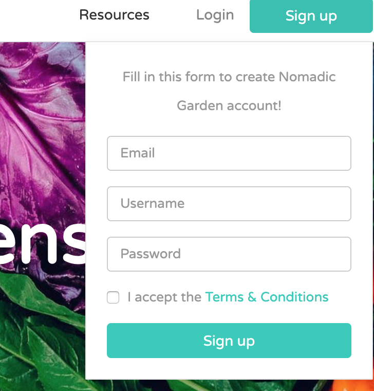

## Nomadic Gardens
#### Mid-Term Project for Skill Distillery

Team members and roles: 
* Brian Streetman (Developer, Scrum Master)
* Colt Looper (Developer, Repo Owner)
* Jacob Shorter-Ivey (Developer)
* Jared McGowan (Developer, DBA)

### Overview
Nomadic Gardens is a full-stack web application written in Java. 
Data is persisted (using JPA & MySQL) into a database that is spun up on an
AWS server. More information about the technologies used can be found toward bottom of the page.

Nomadic Gardens ties local community gardens together allowing the users to showoff their goods, as well as trade & barter for goods with other community garden users. As of now, we are tying gardens together in the Denver area.

### Description

#### Home Page
Upon landing at the home page, a non logged-in user can view all of the gardens in the community as well as all of the produce being offered for barter. In order to interact with other growers, however, you have to create a profile. 

To create a profile click the 'Sign up' button.

