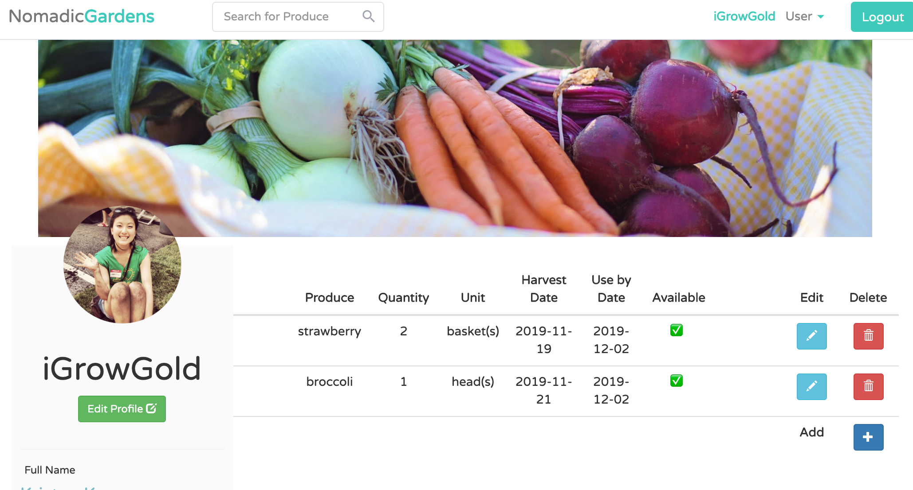
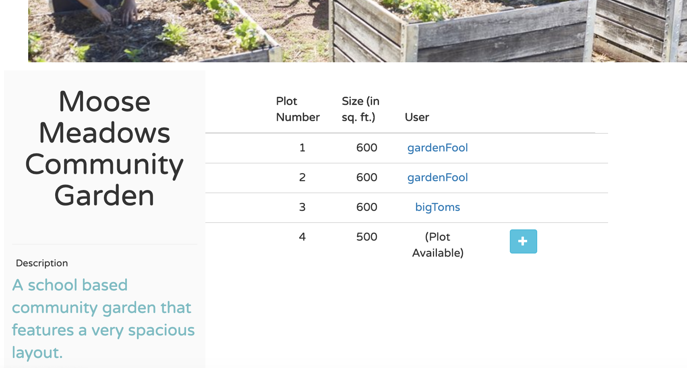
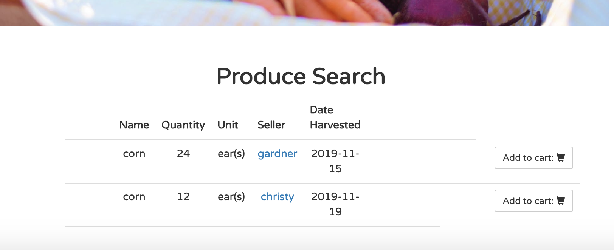
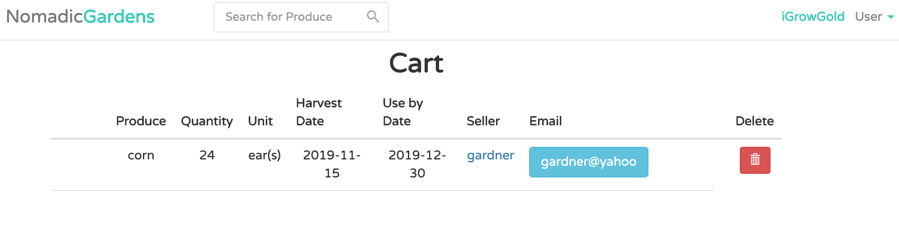
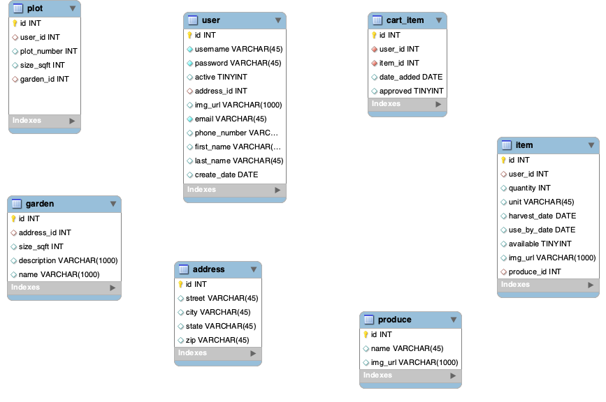

## Nomadic Gardens
#### Mid-Term Project for Skill Distillery
```
Team members and roles: 
* Brian Streetman (Developer, Scrum Master)
* Colt Looper (Developer, Repo Owner)
* Jacob Shorter-Ivey (Developer)
* Jared McGowan (Developer, DBA)
```
### Overview
```
Nomadic Gardens is a full-stack web application written in Java. 
Data is persisted (using JPA & MySQL) into a database that is spun up on an
AWS server. More information about the technologies used can be found toward bottom of the page.

Nomadic Gardens ties local community gardens together allowing the users to showoff their goods, as well as trade & barter for goods with other community garden users. As of now, we are tying gardens together in the Denver area.
```

## Description

### Home Page
```
Upon landing at the home page, a non logged-in user can view all of the gardens in the community as well as all of the produce being offered for barter. In order to interact with other growers, however, you have to create a profile. 

To create a profile click the 'Sign up' button.
```


### User Profile Page




### Claiming a Plot as a User

Once a user has created a profile, he/she can then go in and browse gardens for an open plot to farm! If the user finds a plot at a garden that suits them, click the 'claim plot' button. 




### Searching Produce Available for Barter or Trade

A user can find produce that they are interested in by searching produce by keyword at the top of the page, by looking up individual users at gardens, and by searching the garden pages!




### Claiming/Adding produce to Your Cart

A user can claim/add produce to their cart. To do this, click the add to cart button. Once the item is added to your cart, it populates on your cart page & the item becomes unavailable to other users. This feature was added so that the platform wasn't just an application to manage plots and gardens, but also a bartering/trade platform.




### Implementation

To persist the users data, we used JPA MySQL. We designed a database with seven tables to handle the operations and storing of information. Below is the EER Diagram representing our database.




### Technologies and Methodologies Used
* Java
* Spring MVC
* JPA
* MySQL
* HTML/CSS
* Agile Methodology
* Git/ GitHub
* Pair Programming
* Trello
* MAMP
* Gradle
* Bootstrap

### Lessons Learned 

Overall, the project went as well as we hoped. We believe that the planning phase (schema design, wire-framing, etc.) largely contributed to the success of the project. We certainly believe that it is essential to have a well-planned design before implementing any code. Once we had our schema forward-engineered, we found that the JUnit tests were crucial to ensuring we had a solid foundation before continuing on to the phase.

We found it tremendously worthwhile to double check with each team member to make sure there weren’t multiple members working on the same file – which prevented merge conflicts on GitHub. We learned that having clear and well-defined objectives that could be completed in isolated 
divisions of labor made the flow of work seem much more manageable. Each defined user story was completed in sequential order before moving on to the next goal. 

## Stretch Goals

We were able to complete a few of our stretch goals - including each registered user having a cart that contains selected items to buy from other sellers’ profiles. This particular stretch goal added user-friendly functionality that will help facilitate an easier experience for anyone wanting to buy vegetables from another user. Another stretch goal that we were able to add is the ability for each registered user to claim vacant plots from a garden.

If given an extra day in our sprint, we would have incorporated a rating system for each buyer and user. Reviews, of course, help protect buyers and sellers from engaging in less-than-satisfactory exchanges. Having said feature in our site would help ensure a positive experience for each user. 
